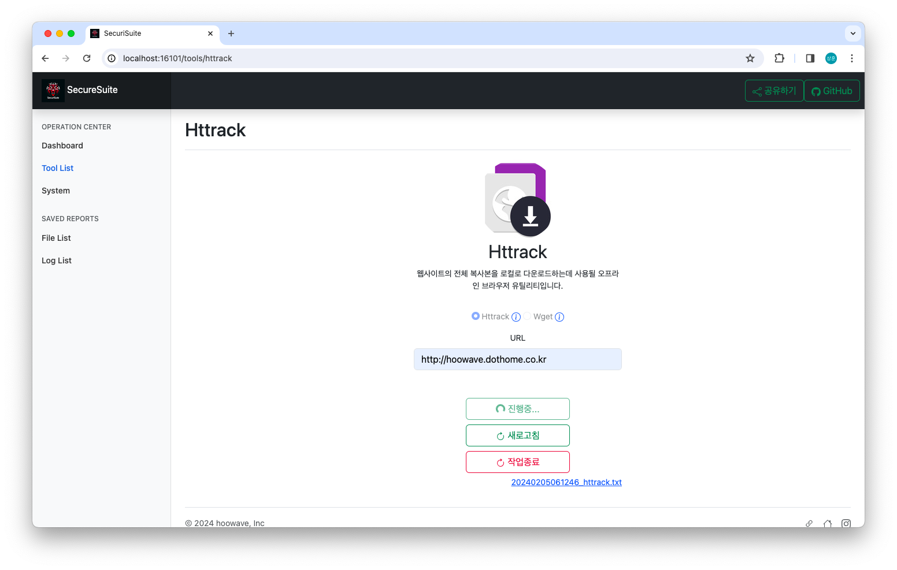

<div align="center">

<p>본 프로젝트는 [SecuriSuite]로, SecuriSuite는 브라우저에서 정보 보안 도구를 사용하기 위한 그래픽 인터페이스입니다.</br>
이 프로젝트는 Kali Linux 도구를 참조로 사용합니다.</p>
</div>

## 프로젝트 개요

<details>
<summary>자세히</summary>

본 프로젝트는 기존 JSP 기반의 "라메르 사이트"를 현대적인 웹 개발 표준과 확장성을 고려하여 전면적으로 리팩토링하는 작업입니다.</br>
이전 구조의 제한점을 극복하고, 더 나은 사용자 경험과 보안성을 제공하기 위해 수행되었습니다.</br>
라메르사이트 프로젝트 [@Legacy_Project_Lamer](https://github.com/hoowave/Legacy_Project_Lamer)

### 프로젝트 소개

SecuriSuite는 이러한 강력한 도구들을 더욱 접근하기 쉽고 사용자 친화적인 방식으로 제공하여, 보안 전문가들이 필요한 도구를 쉽게 찾고 사용할 수 있도록 돕습니다.</br>
프로젝트의 설계 및 개발 과정에서는 소프트웨어 시스템을 모델링할 때 문제 영역(도메인)을 중심으로 접근하는 도메인 주도 개발(DDD)을 채택했습니다.</br>
이 접근 방식은 복잡한 시스템을 보다 효과적으로 설계하고 관리할 수 있게 하며, 비즈니스 요구사항과 소프트웨어 설계 간의 간극을 줄이는 데 중점을 두었습니다.</br>

### 주요 개선사항

* 성능 및 안정성 향상: 새로운 아키텍처와 최적화된 코드를 통해 사이트의 반응 속도 및 안정성이 크게 향상되었습니다.
* 보안 강화: 최신 보안 기준에 맞춰 시스템을 재설계함으로써 사용자 데이터 보호 및 사이트 보안을 크게 강화했습니다.</br>
  특히, 이전 시스템에서 발견된 쉘 권한 취약점을 개선하였습니다. 과거에는 쉘 권한을 얻어 명령을 수행하는 방식이었지만, 이제는 ProcessBuilder 객체를 활용하여 보다 안전하게 시스템 명령을 수행할 수
  있게 되었습니다. 이를 통해 시스템 명령의 실행 과정에서 발생할 수 있는 보안 위험을 현저히 줄였으며, 전체적인 시스템의 안정성과 보안성을 향상시켰습니다.
* 유지보수 및 확장성 개선: 모듈화된 구조와 체계적인 코드 관리를 도입하여, 향후 기능 추가 및 유지보수가 보다 용이해졌습니다.
* 사용자 요구사항 반영: 사용자의 피드백을 바탕으로 한 기능 추가 및 개선을 통해 사용자 만족도를 높였습니다.

</details>

## 시작하기

<details>
<summary>Docker</summary>

### 전제조건

* [Docker](https://docs.docker.com/get-docker/)가 설치되어 있어야 합니다.

### 설치방법

1. 도커 이미지 다운로드: 다음 명령을 사용하여 필요한 도커 이미지를 내려받으세요.

```shell
docker pull hoowave/securisuite-backend:latest
docker pull hoowave/securisuite-frontend:latest
```

2. Docker Compose 파일 다운로드: 프로젝트의 Docker Compose 파일을 다운로드합니다.

- [docker-compose.yml](https://drive.google.com/file/d/11O4yyHkw2wlVGkdnxelkFOfu3QzbdHEv/view?usp=drive_link)

3. 프로젝트 실행 : 다운로드한 Docker Compose 파일이 있는 디렉토리로 이동한 후, 다음 명령을 사용하여 프로젝트를 실행하세요.

```shell
docker-compose up
```

또는 백그라운드 실행

```shell
docker-compose up -d
```

4. 접속 : 웹 브라우저에서 http://localhost:16101 으로 접속합니다.

* 16101 : Front-End 서비스를 제공합니다.
* 16102 : Back-End 서비스를 제공합니다.
* 16103 : DataBase 서비스를 제공합니다.
* 16104 : 파일 서비스를 제공합니다.

</details>

<details>
<summary>Docker Compose</summary>

### 전제조건

* [Docker](https://docs.docker.com/get-docker/)가 설치되어 있어야 합니다.
* [Docker Compose](https://docs.docker.com/compose/install/)가 설치되어 있어야 합니다.

### 설치방법

1. 프로젝트 복제: 이 GitHub 저장소를 클론합니다.
2. 프로젝트 빌드 및 실행: 다음 명령어로 애플리케이션을 빌드 및 실행합니다.
   `docker-compose up`</br>
3. 접속 : 웹 브라우저에서 http://localhost:16101 으로 접속합니다.

* 16101 : Front-End 서비스를 제공합니다.
* 16102 : Back-End 서비스를 제공합니다.
* 16103 : DataBase 서비스를 제공합니다.
* 16104 : 파일 서비스를 제공합니다.

</details>

<details>
<summary>SpringBoot Application</summary>

### 전제조건

* Kali Linux 설치: SecuriSuite는 Kali Linux 환경에서 작동하도록 설계되었습니다. 따라서 Kali Linux가 설치되어 있어야 합니다.</br>
* Kali Linux는 [공식 웹사이트](https://kali.org/)에서 다운로드할 수 있습니다.</br>
* 시스템 요구 사항 확인: Kali Linux가 원활하게 실행될 수 있도록 충분한 하드웨어 리소스(예: 메모리, CPU)를 확보해야 합니다.</br>
* 필요에 따라 패키지를 설치해야 할 수도 있습니다.</br>

### 설치방법

1. 프로젝트 다운로드: GitHub 또는 프로젝트 제공 페이지에서 SecuriSuite 프로젝트를 다운로드합니다.</br>
2. Kali Linux에 프로젝트 추가: 다운로드한 프로젝트를 Kali Linux 환경에 추가합니다. 이는 해당 프로젝트의 빌드 환경을 Kali Linux에 맞추기 위함입니다.</br>
3. 파일 권한 설정: 프로젝트와 관련된 결과물을 웹서버에서 제공하기 위해 필요한 권한을 설정합니다. 터미널에서 다음 명령을 실행합니다.</br>
   `sudo chmod -R 755 /var/www/html/`</br>
4. 빌드 및 실행: 서버 시작과 종료를 간편하게 관리할 수 있도록 쉘 스크립트를 실행합니다. </br>
   서버 시작 : `./run`</br>
   서버 종료 : `./stop`</br>
5. 접속 : 웹 브라우저에서 http://localhost:16101 으로 접속합니다.

- 데이터베이스 및 BackEnd 서버와 FrontEnd 서버가 서로 통신할 수 있도록 적절한 IP 주소로 설정을 조정해야 합니다.

* 16101 : Front-End 서비스를 제공합니다.
* 16102 : Back-End 서비스를 제공합니다.
* 3306 : DataBase 서비스를 제공합니다.
* 80 : 파일 서비스를 제공합니다.

</details>

## API & 문서

<details>
<summary>API Document</summary>

API는 예제를 통해 제공됩니다.</br>

* [Architecture & API](BackEnd/src/main/java/com/securisuite/backend/README.md) - 데이터 처리 아키텍처 및 각 API에 대한 완성된 예시입니다. 이
  예시는 실제 프로젝트에서 나온 것입니다.
* [Interface](FrontEnd/README.md) - 사용자가 직관적으로 보여질 인터페이스에 대한 문서입니다.

</details>

## 업데이트

<details>
<summary>업데이트 목록</summary>

### [자세히](UPDATE.md)

<details>
<summary>2024-02-20</summary>

1. 결과 파일 및 로그 파일 다운로드 기능 개선

</details>

<details>
<summary>2024-02-05</summary>

1. Docker를 사용한 배포 및 프로젝트 실행
2. Docker Compose를 사용한 배포 및 프로젝트 실행

</details>

<details>
<summary>2024-02-01</summary>

1. 기능별 결과 파일 및 로그 파일 다운로드 지원
2. 대시보드 및 결과 파일, 로그 파일 다운로드 지원에 대한 리포트 API서버 추가

</details>

<details>
<summary>2024-01-31</summary>

1. 사용자 대시보드 강화

</details>

<details>
<summary>2024-01-30</summary>

1. MariaDB & JPA 리포지토리 연동작업
2. UI(Interface) 제작 및 API 통신 작업
3. BackEnd 서버, FrontEnd 서버 분리 작업

</details>

<details>
<summary>2024-01-19</summary>

1. John the Ripper API 서버 추가
2. 파일 경로 공통화 작업 및 클래스 분리

</details>

<details>
<summary>2024-01-17</summary>

1. 로그 및 결과파일 웹서버 업로드 작업
2. Httrack API 서버 추가
3. Wget API 서버 추가

</details>
</details>

## 기술 스택 & 패키지

<details>
<summary>기술 스택</summary>

* Java: 애플리케이션 개발에 사용된 프로그래밍 언어입니다.
* Spring Boot: 애플리케이션의 백엔드 로직을 구현하기 위해 사용된 프레임워크입니다.
* Lombok: 코드 간결성을 향상시키기 위해 사용된 라이브러리입니다.
* Spring Boot Validation: 입력 데이터의 유효성 검사를 위해 사용된 스프링 부트의 검증 프레임워크입니다.
* Linux/Unix Shell: Kali Linux 환경에서 쉘 명령을 실행하기 위해 사용된 시스템 환경입니다.
* 정규 표현식 (Regex): 로그 데이터 파싱 및 데이터 정형화에 사용된 기술입니다.
* Spring Data JPA & MariaDB: 사용자의 명령 사용 기록을 데이터베이스에 저장하고 관리하는 데 사용될 것입니다. 이 데이터를 기반으로 사용자에게 통계 정보를 제공하고, 사용자 경험을 향상시키는
  인사이트를 얻을 수 있게 됩니다. JPA를 통해 데이터 모델링과 접근을 간소화하고, 더 효율적인 데이터 처리를 가능하게 합니다.
* Thymeleaf: 서버 사이드 Java 템플릿 엔진으로, 동적인 웹 페이지를 생성하기 위해 사용됩니다.
* Bootstrap: 반응형 웹 디자인을 쉽게 구현하기 위한 프론트엔드 프레임워크입니다. Bootstrap을 사용하여 모던하고 사용자 친화적인 인터페이스를 구축할 예정입니다.
* JavaScript (jQuery): 동적인 사용자 인터페이스와 웹 페이지 상호작용을 구현하기 위해 사용됩니다.
* Docker: 프로젝트의 포터블성과 접근성을 향상시키기 위해 사용될 것입니다. Docker 컨테이너를 통해 사용자가 별도의 Kali Linux 운영체제 설치 없이도 프로젝트를 쉽게 설정하고 실행할 수 있게
  됩니다. 이를 통해 사용자는 어떤 환경에서든 프로젝트를 손쉽게 시작하고, 필요한 작업을 빠르게 수행할 수 있습니다.

</details>

<details>
<summary>패키지</summary>

* Crunch: 패스워드 생성 및 관리에 사용되는 도구로, 맞춤형 단어 목록을 생성하는 데 사용합니다.
* Nmap ("Network Mapper"): 네트워크 탐색 및 보안 감사에 사용되는 오픈 소스 도구로, 네트워크의 호스트 탐지, 서비스 및 운영 체제 감지 등에 사용합니다.
* HTTrack: 웹사이트의 전체 복사본을 로컬로 다운로드하는데 사용될 오프라인 브라우저 유틸리티입니다.
* John the Ripper: 암호의 강도를 테스트하고 복구하는데 사용될 패스워드 크래킹 도구입니다.

</details>

## 스크린샷


<details>
<summary>Nmap</summary>


</details>

<details>
<summary>Httrack</summary>




</details>

<details>
<summary>Crunch</summary>


</details>

<details>
<summary>John The Ripper</summary>


</details>


## [누가 개발했어?](https://linktr.ee/hoowave)